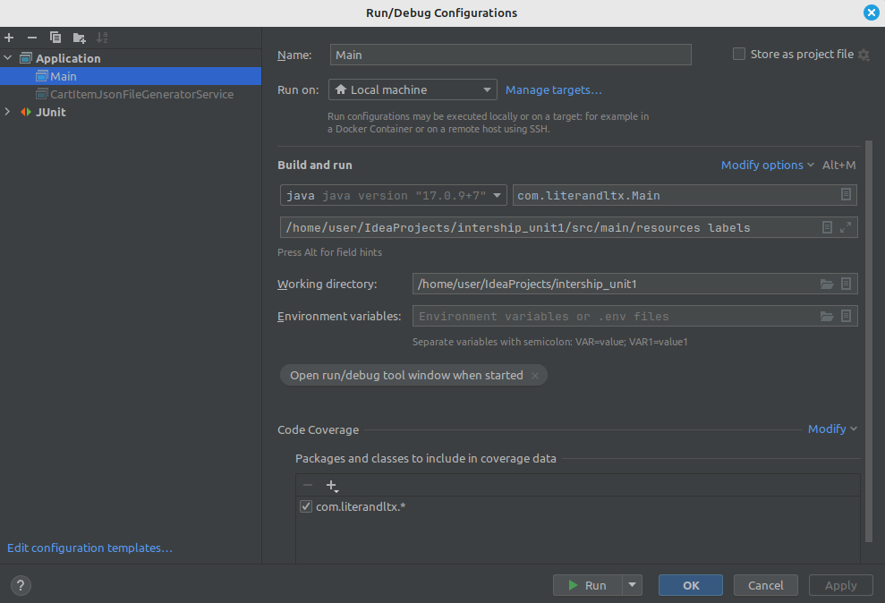

## Quick start
Input args[] params: <folder-path> <statistic-value>

As param <statistic-value> only allowed:
"title", "description", "group", "labels", "rank"

### Input params example



## Generate dataset
Class CartItemJsonFileGeneratorService util class to generate json file with random items. 
Data for item choose random from appropriate dataset (array).
The class provides the ability to generate a selected number of files with a certain random number of elements in each file
All files are saved in the selected folder

## Domain model
CartItemList-CartItem one-to-many relationship.

CartItem attributes description:
1. title (String): The title of the item.
2. description (String): A description of the item.
3. group (String): The group/category to which the item belongs.
4. labels (String): Any labels or tags associated with the item.
5. rank (Double): A numerical ranking or score associated with the item.

### JSON CartItem representation example

```json
[
  {
    "title": "Spirited Away",
    "description": "A Japanese animated fantasy film",
    "group": "Anime",
    "labels": "fantasy, adventure, supernatural",
    "rank": 3.31
  },
  {
    "title": "The Legend of Zelda: Breath of the Wild",
    "description": "An action-adventure video game",
    "group": "Game",
    "labels": "action, adventure, open-world",
    "rank": 7.47
  }
]
```

### Statistic by group result in XML example

```xml
<?xml version="1.0" encoding="UTF-8" standalone="yes"?>
<statistics>
    <item>
        <count>1</count>
        <value>Anime</value>
    </item>
    <item>
        <count>1</count>
        <value>Game</value>
    </item>
</statistics>
```

### Statistic by labels result in XML example
```xml
<?xml version="1.0" encoding="UTF-8" standalone="yes"?>
<statistics>
    <item>
        <count>1</count>
        <value>open-world</value>
    </item>
    <item>
        <count>1</count>
        <value>supernatural</value>
    </item>
    <item>
        <count>1</count>
        <value>action</value>
    </item>
    <item>
        <count>2</count>
        <value>adventure</value>
    </item>
    <item>
        <count>1</count>
        <value>fantasy</value>
    </item>
</statistics>
```

## Performance analysis: (average):
128 files with up to 100_000 items each (the same data set for each test)
- 1 thread: 7.5 sec, 
- 2 threads: 6.7 sec
- 4 threads: 5.2 sec
- 8 threads: 5.0 sec